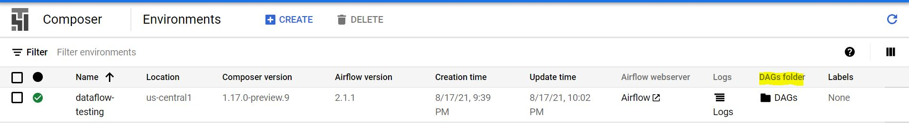

# Cloud Composer
This is one of the part of **Introduction to Cloud Composer** Repository. Here we will try to learn basics of Apache Ariflow to create Dags. We will learn step by step how to create a batch pipeline using [German Credit Risk](https://www.kaggle.com/uciml/german-credit). The complete process is divided into 7 parts:

1. **Setting up the Cloud Composer environment**
2. **Setting up Dataflow job to run in Dag**
3. **Running a Dag from Airflow**


## Motivation
For the last two years, I have been part of a great learning curve wherein I have upskilled myself to move into a Machine Learning and Cloud Computing. This project was practice project for all the learnings I have had. This is first of the many more to come. 
 

## Libraries/frameworks used

<b>Built with</b>
- [Apache Beam](https://beam.apache.org/documentation/programming-guide/)
- [Anaconda](https://www.anaconda.com/)
- [Python](https://www.python.org/)
- [Google DataFlow](https://cloud.google.com/dataflow)
- [Google Cloud Storage](https://cloud.google.com/storage)
- [Google Bigquery](https://cloud.google.com/bigquery)
- [Google Cloud Composer](https://cloud.google.com/composer/docs/concepts/overview)
- [Apache Airflow](https://airflow.apache.org/docs/apache-airflow/stable/)

## Cloning Repository

```bash
    # clone this repo:
    git clone https://github.com/adityasolanki205/Cloud-Composer.git
```

## Pipeline Construction

Below are the steps to setup the enviroment and run the codes:

1. **Setup**: First we will have to setup free google cloud account which can be done [here](https://cloud.google.com/free). Then we need to Download the data from [German Credit Risk](https://www.kaggle.com/uciml/german-credit).

2. **Cloning the Repository to Cloud SDK**: We will have to copy the repository on Cloud SDK using below command:

```bash
    # clone this repo:
    git clone https://github.com/adityasolanki205/Cloud-Composer.git
```

3. **Setting up Dataflow job**: Now we will setup the whole Dataflow job that will fetch data from GCS bucket and populate data in Bigquery. Consider using the repository [Batch Pipeline Using Dataflow](https://github.com/adityasolanki205/Batch-Processing-Pipeline-using-DataFlow). In brief, follow the commands below to setup and save the dataflow template.

```
    1. Copy the repository in Cloud SDK using below command:
       git clone https://github.com/adityasolanki205/Batch-Processing-Pipeline-using-DataFlow.git
    
    2. Create a Storage Bucket in us-central1 by the name batch-pipeline-testing 
       and three sub folders Temp, Template and Stage.
    
    3. Copy the data file in the cloud Bucket using the below command:
       cd Batch-Processing-Pipeline-using-DataFlow/data
       gsutil cp german.data gs://batch-pipeline-testing/
    
    4. Create a Dataset in us-central1 by the name GermanCredit
    
    5. Create a table in GermanCredit dataset by the name GermanCreditTable
    
    6. Install Apache Beam on the SDK using below command:
       pip3 install apache_beam[gcp]
       
    7. Run the command below to in cloud shell to save the template in Template folder of the GCS created
       python3 batch-pipeline.py \
       --runner DataFlowRunner \
       --project <Your Project Name> \
       --temp_location gs://batch-pipeline-testing/Temp \
       --staging_location gs://batch-pipeline-testing/Stage \
       --input gs://batch-pipeline-testing/Batch/german.data \
       --region asia-east1 \
       --job_name germananalysis \
       --template_location gs://batch-pipeline-testing/Template/batch-pipeline-template
    
``` 

4. **Setting up Cloud Composer Environment**: Cloud Composer uses Apache Airflow to run the Dags. So we will use the setup below to create the Environment. 

```
    1. Name: Provide the name of the Environment
    
    2. Location: Provide the location where the Dags have to run. We have taken us-central1
    
    3. Machine-Type: Opt any machine type you want. If you are using Google Free Tier account, 
                     then opt for n1-standard-2
    
    4. Disk Size: We will use 50 GB
    
    5. Image Version: We will use the latest version of apache Airflow: Composer-1.17.0-preview-9-airflow-2.1.1
    
    6. Python Version: We will use python version '3'
    
    7. Click on Create
``` 

5. **Creating Configuration file**: Now we create Python files to be used to create the DAGs. First we will create the file called Config.py. This will contain all the configuration related parameters. Save this file by the name Config.py.

```python
    #Project Configurations
    project_name=<your project name>
    
    #Zone in which the Dag(Dataflow job) has to run
    zone = 'us-central1-a'
    
    #Name of the Bucket where Dataflow Template is saved
    template_bucket = 'batch-pipeline-testing'
    
    #Name of the Dataflow pipeline
    job_name ='batch-pipeline'
    
    #Name of input file and its path to GCS bucket
    input_data ='gs://{bucket}/german.data'.format(bucket=template_bucket)
    
    #Path of the GCS bucket where Dataflow Template is saved
    template_gcs_path='gs://{bucket}/Template/batch-pipeline-template'.format(bucket=template_bucket)
    
    #Temprory GCS path location
    temp_location='gs://{bucket}/Temp'.format(bucket=template_bucket)
```

6. **Dag Arguments file**: Now we will create the file that will contain all the Dag Arguments that are required by the Apache Airflow to run it. This File will return Body of the parametres required to run the dag. Save this file by the name dag_arguments.py.

```python
    import Config
    class DAGArgs():
        default_args = {
                'owner': 'airflow',
                'depends_on_past': False,
                'start_date':'16-08-2021',
                'email': ['airflow@example.com'],
                'email_on_failure': False,
                'email_on_retry': False,
                'retries': 3,
                'retry_delay': timedelta(minutes=5),
                'execution_timeout': timedelta(hours=5),
        }
        def __init__(self, *args, **kwargs):
            print("in DAG Arguments")
        def get_daily_trigger_dataflow_body(job_name,temp_location, zone, input_data):
            body = {
                "jobName": "{jobname}".format(jobname=job_name),
                "parameters": {
                    'runner': 'DataFlowRunner',
                },
                "environment": {
                    "tempLocation": temp_location,
                    "zone": zone
                }
            }
            return body
```

7. **Daily Sync dag**: Now we will create the Dag file that will be used to initiate the Dag. Here we will initiate one single Dag which will be a Dataflow job. Save this file by the name daily_sync_dag.py

```python
    import airflow
    from airflow import DAG
    from airflow import models
    from airflow.operators.python_operator import PythonOperator
    from dag_arguments import DAGArgs
    from googleapiclient.discovery import build
    from oauth2client.client import GoogleCredentials
    import Config

    def daily_sync_etl():
        try:
            job_name = Config.job_name
            temp_location = Config.temp_location
            zone = Config.zone
            input_data = Config.input_data
            #input_param_name = Config.input_param_name
            gcs_path = Config.template_gcs_path
            
            body = DAGArgs.get_daily_trigger_dataflow_body(job_name,temp_location,zone,input_data)
            
            credentials = GoogleCredentials.get_application_default()
            
            service = build('dataflow', 'v1b3', credentials=credentials,cache_discovery=False)
            request = service.projects().templates().launch(projectId=Config.project_name
            ,gcsPath=Config.template_gcs_path, body=body)
            
            response = request.execute()
            
            print("-----execute function have been called-------")
            print(response)
        except Exception as ex:
            print(['Exception', ex])

    try:
        with models.DAG(
                'GCS_to_Bigquery_dag',
                default_args=DAGArgs().default_args,
                description='DAG for Hourly sync to cloud sql',
                max_active_runs=1,
                concurrency=4,
                catchup = False,
                schedule_interval='@hourly'
            ) as dag:
                task1 = PythonOperator(
                        task_id='daily-sync-etl',
                        python_callable=daily_sync_etl,
                        dag = dag)
    except IndexError as ex:
        logging.debug("Exception",str(ex))

    task1
```

8. **Finally uploading all the files in Dags Repository**: All the .py files have to be uploaded to DAGs Folder visible on the Cloud composer Environments Screen. 



9. **Inserting Data in Bigquery**: Final step in the Pipeline it to insert the data in Bigquery. To do this we will use **beam.io.WriteToBigQuery()** which requires Project id and a Schema of the target table to save the data. 

```python
    import apache_beam as beam
    from apache_beam.options.pipeline_options import PipelineOptions
    import argparse
    
    SCHEMA = 
    '
    Duration_month:INTEGER,
    Credit_history:STRING,
    Credit_amount:FLOAT,
    Saving:STRING,
    Employment_duration:STRING,
    Installment_rate:INTEGER,
    Personal_status:STRING,
    Debtors:STRING,
    Residential_Duration:INTEGER,
    Property:STRING,
    Age:INTEGER,
    Installment_plans:STRING,
    Housing:STRING,
    Number_of_credits:INTEGER,
    Job:STRING,
    Liable_People:INTEGER,
    Telephone:STRING,
    Foreign_worker:STRING,
    Classification:INTEGER,
    Month:STRING,
    days:INTEGER,
    File_Month:STRING,
    Version:INTEGER
    '
    ...
    def run(argv=None, save_main_session=True):
        ...
        parser.add_argument(
          '--project',
          dest='project',
          help='Project used for this Pipeline')
        ...
        PROJECT_ID = known_args.project
        with beam.Pipeline(options=PipelineOptions()) as p:
            data = (p 
                     | beam.io.ReadFromText(known_args.input) )
            parsed_data = (data 
                     | 'Parsing Data' >> beam.ParDo(Split()))
            filtered_data = (parsed_data
                     | 'Filtering Data' >> beam.Filter(Filter_Data))
            Converted_data = (filtered_data
                     | 'Convert Datatypes' >> beam.Map(Convert_Datatype))
            Wrangled_data = (Converted_data
                     | 'Wrangling Data' >> beam.Map(Data_Wrangle))    
            Cleaned_data = (Wrangled_data
                     | 'Delete Unwanted Columns' >> beam.Map(Del_Unwanted)  
            Output =( Cleaned_data      
                     | 'Writing to bigquery' >> beam.io.WriteToBigQuery(
                       '{0}:GermanCredit.GermanCreditTable'.format(PROJECT_ID),
                       schema=SCHEMA,
                       write_disposition=beam.io.BigQueryDisposition.WRITE_APPEND)
                    )

    if __name__ == '__main__':
        run()        
```

## Tests
To test the code we need to do the following:

    1. Copy the repository in Cloud SDK using below command:
    git clone https://github.com/adityasolanki205/Batch-Processing-Pipeline-using-DataFlow.git
    
    2. Create a Storage Bucket in asia-east1 by the name batch-pipeline-testing and two sub folders Temp and Stage.
    
    3. Copy the data file in the cloud Bucket using the below command
    cd Batch-Processing-Pipeline-using-DataFlow/data
    gsutil cp german.data gs://batch-pipeline-testing/
    
    4. Create a Dataset in asia-east1 by the name GermanCredit
    
    5. Create a table in GermanCredit dataset by the name GermanCreditTable
    
    6. Install Apache Beam on the SDK using below command
    pip3 install apache_beam[gcp]
    
    7. Run the command and see the magic happen:
     python3 batch-pipeline.py \
     --runner DataFlowRunner \
     --project <Your Project Name> \
     --temp_location gs://batch-pipeline-testing/Temp \
     --staging_location gs://batch-pipeline-testing/Stage \
     --input gs://batch-pipeline-testing/Batch/german.data \
     --region asia-east1 \
     --job_name germananalysis
     
     Note: This Repository also include local.py to run the Apache Beam job on you local machine.To Run
     locally, run the command below:
     
     python -m Local --input ./data/german-original.data --output ./output/testing.txt
     
    Optional Step to run this job as a Custom Template
     
    8. If you wish to run this Dataflow job as a Custom Template, use the command below 
    to create the template in GCS bucket of your choice.
     python3 batch-pipeline.py \
     --runner DataFlowRunner \
     --project <Your Project Name> \
     --temp_location gs://batch-pipeline-testing/Temp \
     --staging_location gs://batch-pipeline-testing/Stage \
     --input gs://batch-pipeline-testing/Batch/german.data \
     --region asia-east1 \
     --job_name germananalysis \
     --template_location gs://batch-pipeline-testing/Template/batch-pipeline-template


## Credits
1. Akash Nimare's [README.md](https://gist.github.com/akashnimare/7b065c12d9750578de8e705fb4771d2f#file-readme-md)
2. [Apache Beam](https://beam.apache.org/documentation/programming-guide/#triggers)
3. [Building Data Processing Pipeline With Apache Beam, Dataflow & BigQuery](https://towardsdatascience.com/apache-beam-pipeline-for-cleaning-batch-data-using-cloud-dataflow-and-bigquery-f9272cd89eba)
4. [How to Trigger DataFlow Jobs on Cloud Composer](https://sparks.mediaagility.com/how-to-run-dataflow-jobs-on-cloud-composer-with-cloud-composer-set-up-steps-f491efe29328)
